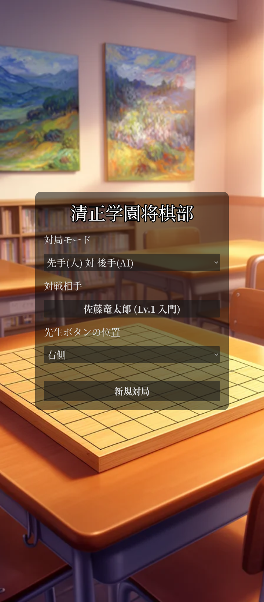
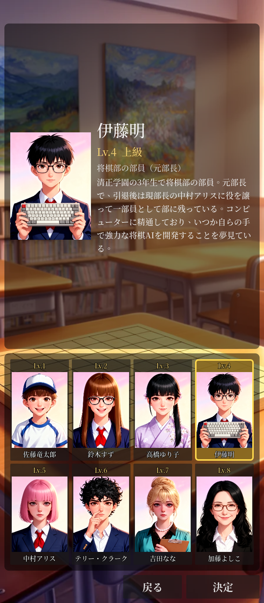
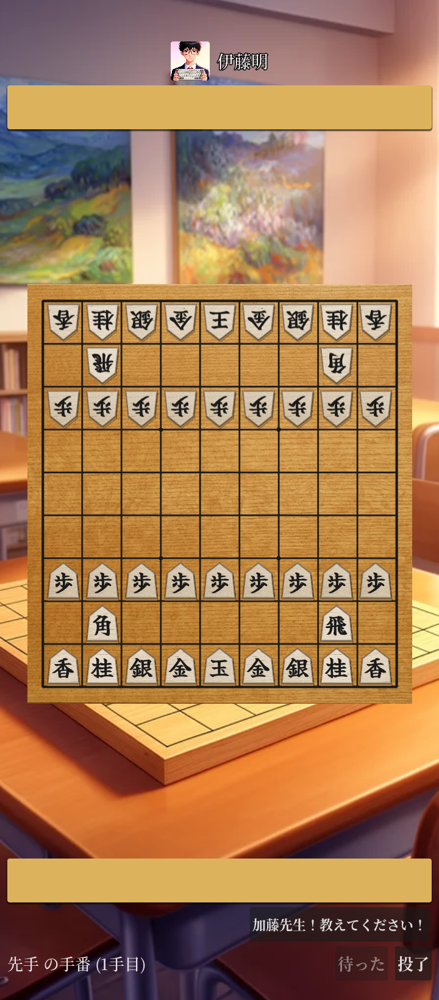
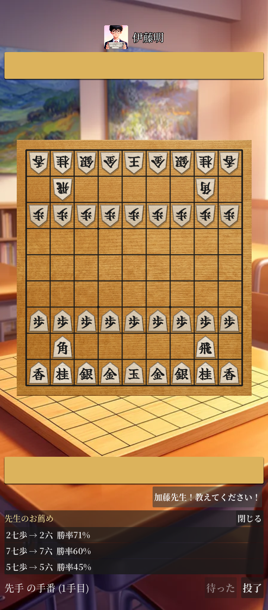

# 清正学園将棋部

シングルプレイヤー向けの Android 用本将棋ゲーム。タップ操作で 9×9
将棋盤を動かし、合法手判定（王手・二歩・打ち歩詰め・千日手）を
完全に行い、AlphaZero スタイルの AI 対局相手は端末内（オフライン）
で動作する。

## スクリーンショット

| タイトル画面 | 対戦相手選択 | 初期局面 | 先生モードの提案 |
|:---:|:---:|:---:|:---:|
|  |  |  |  |

## 主な機能

- **完全な本将棋ルール** — 王手、二歩、打ち歩詰め、千日手（連続王手の千日手は反則負け）、入玉判定（27 点法）まで native ルール層で処理。
- **オフライン AI 対局** — AlphaZero 系の policy + value ネット（`models/bonanza.onnx`、Bonanza 学習済み）を `tract` で端末内推論。MCTS は単一スレッド PUCT、強さは playouts と temperature の組で 8 段階に調整。
- **8 人の対戦相手** — 対戦相手選択画面で部員と先生から選んで対局。Lv 1 佐藤竜太郎 / Lv 2 鈴木すず / Lv 3 高橋ゆり子 / Lv 4 伊藤明 / Lv 5 中村アリス（部長）/ Lv 6 テリー・クラーク（主将）/ Lv 7 吉田なな（顧問）/ Lv 8 加藤よしこ（師範）。各キャラクターは肖像画 + 紹介付きで、選択した相手は対局中も上部に表示される。
- **先生モード** — 対局中に「加藤先生！教えてください！」ボタンを押すと、現局面を MCTS で読んで上位 3 候補手を勝率付きで提示。実際に指す手はプレイヤー自身が選ぶ。
- **対局体験** — 待った（多段階 undo）、投了、最終手ハイライト、駒音／効果音（駒打ち・捕獲・成り・王手・詰み）、ハプティック振動、対局の中断 / 続きから。
- **将棋盤の見た目** — 本榧風の木目テクスチャ、4% の伝統的な盤縁、五角形駒（駒木材ランダムサンプリング + ベベル + 影）、駒文字は「Fude Goshirae」筆書体。

## ステータス

1.0 リリース前のプレイ可能段階。Linux デスクトップでの開発実行と、
Android arm64-v8a 向け APK のビルド・インストールに対応している。
合法手判定（王手・二歩・打ち歩詰め・千日手）と AI 対局は動作中。
Play ストア公開に向けた仕上げ作業は継続中で、詳細は
[`ROADMAP.md`](./ROADMAP.md) のフェーズ 7 を参照。

## クイックスタート

リポジトリをクローンしたうえで、Godot で開くか APK をビルドする。

### デスクトップ開発（Linux）

前提: Godot 4.6.2 を
`~/.local/bin/Godot_v4.6.2-stable_linux.x86_64` に配置。Rust 1.93
（`native/shogi_core/rust-toolchain.toml` で固定）。

```bash
# 1. ネイティブ GDExtension をビルド
cargo build --release --manifest-path native/shogi_core/Cargo.toml
cp native/shogi_core/target/release/libshogi_core.so \
   native/bin/linux/x86_64/

# 2. プロジェクトを開く
~/.local/bin/Godot_v4.6.2-stable_linux.x86_64 --editor --path .
```

### テスト

```bash
# Rust: 単体テスト + エンコード一致 + perft
cargo test --manifest-path native/shogi_core/Cargo.toml

# GDScript: FFI 経由のルール検証フィクスチャ
~/.local/bin/Godot_v4.6.2-stable_linux.x86_64 \
  --headless -s res://scripts/tests/rules_tests.gd
```

エンコード一致のフィクスチャは `tools/gen_fixtures.py` で再生成する
（ShogiDojo の virtualenv が必要）。

### Android APK

初期セットアップは [`docs/android-build.md`](./docs/android-build.md) を
参照。設定済みであれば以下のコマンドで完結する。

```bash
~/.local/bin/Godot_v4.6.2-stable_linux.x86_64 \
  --headless --path . \
  --export-debug "Android arm64" build/seishingakuen-debug.apk
~/Android/Sdk/platform-tools/adb install -r build/seishingakuen-debug.apk
```

ローカルではビルドパイプライン全体（Rust デスクトップ + Android クロス
コンパイル + フォントサブセット + Godot エクスポート）をまとめて回す
[`tools/build_all.sh`](./tools/build_all.sh) も用意している。署名付き
リリース APK は `--release`、Play ストア用 AAB は `--aab` で生成
できる。

## ドキュメント

- [`ROADMAP.md`](./ROADMAP.md) — フェーズ別の開発計画、完了内容、残課題。
- [`docs/architecture.md`](./docs/architecture.md) — レイヤー構成と各部品の役割。
- [`docs/android-build.md`](./docs/android-build.md) — Android ビルド手順。
- [`docs/android-gotchas.md`](./docs/android-gotchas.md) — Android 固有の落とし穴。症状 → 原因 → 対処。
- [`docs/adr/`](./docs/adr/) — アーキテクチャ意思決定記録（ADR）。
- [`CLAUDE.md`](./CLAUDE.md) — AI ペアプログラマと新規コントリビューター向けのオリエンテーション。

## ライセンスとクレジット

コードは正式リリース前のため、現時点ではライセンス未指定。
同梱フォントはそれぞれ独自のライセンスに従う — 各フォント
ディレクトリを参照のこと。

- [`assets/fonts/fude-goshirae/`](./assets/fonts/fude-goshirae/) — SIL OFL 1.1。
- [`assets/fonts/noto-serif-jp/`](./assets/fonts/noto-serif-jp/) — SIL OFL 1.1。

AI モデル `models/bonanza.onnx` は姉妹プロジェクト
[ShogiDojo](https://github.com/hiroshiyui/ShogiDojo/) からコピーしたもの。再学習はそちらで行う。
