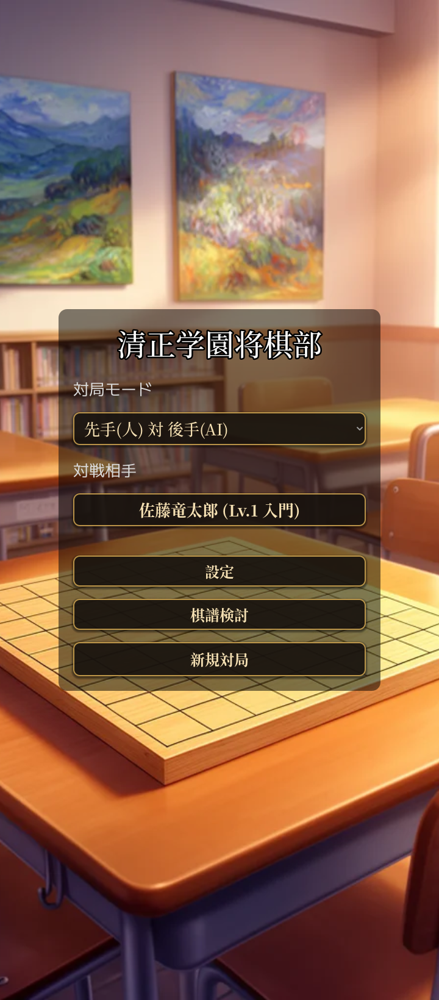
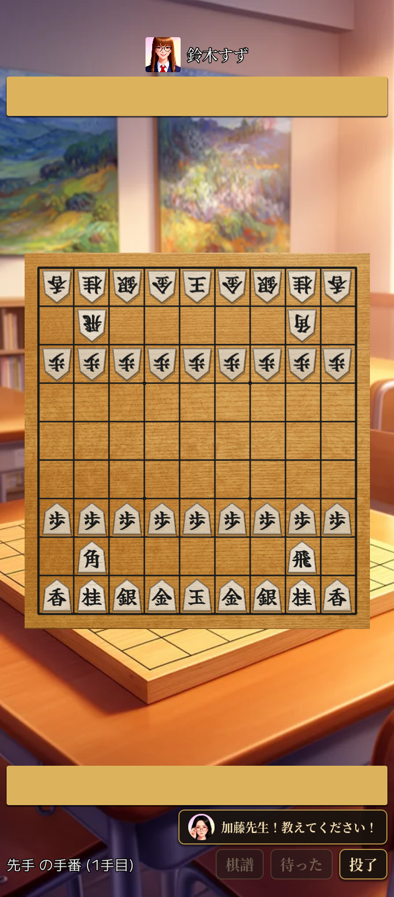
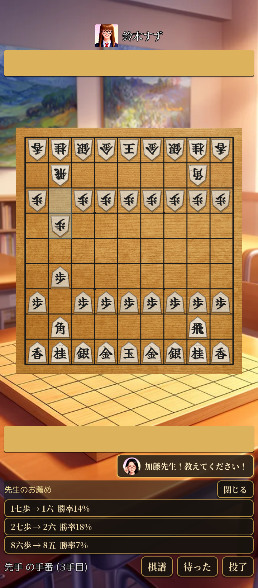
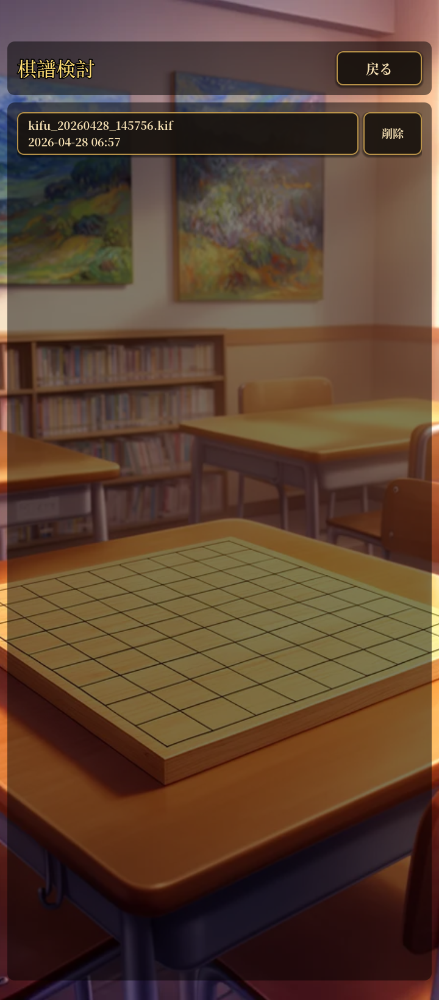
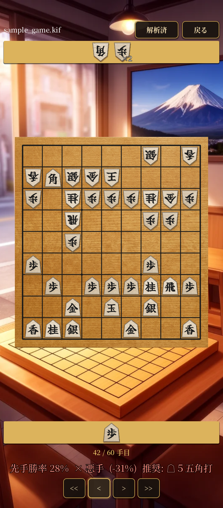

# 清正学園将棋部

シングルプレイヤー向けの Android 用本将棋ゲーム。タップ操作で 9×9
将棋盤を動かし、合法手判定（王手・二歩・打ち歩詰め・千日手）を
完全に行い、AlphaZero スタイルの AI 対局相手は端末内（オフライン）
で動作する。

## ダウンロード

- **[itch.io](https://hiroshiyui.itch.io/seishingakuen-shougibu)**
  — 日本語ストアページから APK を直接ダウンロード。フォロー登録で
  更新通知が受け取れる。
- **[GitHub Releases](https://github.com/hiroshiyui/SeiShinGakuen_ShougiBu/releases)**
  — リリースノート全文と SHA-256 ハッシュ付きの一次配布窓口。

どちらの窓口も同じ署名鍵で署名された同じ APK を配信しているので、
あとから別の窓口の最新版に再インストール無しで更新できる。動作環境は
Android 7.0（API 24）以降 / arm64-v8a。Google Play ストアは方針として
対象外。

## スクリーンショット

| タイトル画面 | 対戦相手選択 | 対局画面 |
|:---:|:---:|:---:|
|  |  |  |

| 先生モード | 棋譜検討（一覧） | 棋譜検討（解析） |
|:---:|:---:|:---:|
|  |  |  |

## 主な機能

- **完全な本将棋ルール** — 王手、二歩、打ち歩詰め、千日手（連続王手の千日手は反則負け）、入玉判定（27 点法）まで native ルール層で処理。
- **オフライン AI 対局** — AlphaZero 系の policy + value ネット（`models/bonanza.onnx`、Bonanza 学習済み）を `tract` で端末内推論。MCTS は単一スレッド PUCT、強さは playouts と temperature の組で 8 段階に調整。
- **8 人の対戦相手** — 対戦相手選択画面で部員と先生から選んで対局。Lv 1 佐藤竜太郎 / Lv 2 鈴木すず / Lv 3 高橋ゆり子 / Lv 4 伊藤明 / Lv 5 中村アリス（部長）/ Lv 6 テリー・クラーク（主将）/ Lv 7 吉田なな（顧問）/ Lv 8 加藤よしこ（師範）。各キャラクターは肖像画 + 紹介付きで、選択した相手は対局中も上部に表示される。
- **先生モード** — 対局中に「加藤先生！教えてください！」ボタンを押すと、現局面を MCTS で読んで上位 3 候補手を勝率付きで提示。実際に指す手はプレイヤー自身が選ぶ。
- **対局体験** — 待った（多段階 undo）、投了、最終手ハイライト、駒音／効果音（駒打ち・捕獲・成り・王手・詰み）、ハプティック振動、対局の中断 / 続きから。
- **棋譜の保存と検討** — 対局中の「棋譜」パネルから .kif で保存（端末の `Android/data/<pkg>/files/Documents/`）。タイトル画面の「棋譜検討」から一覧を開き、再生画面では `<<` `<` `>` `>>` の操作で局面を再現。「解析」ボタンで全手を MCTS にかけ、各手の先手勝率と分類バッジ（◎好手 / △疑問手 / ×悪手）、疑問手以下なら推奨手まで表示。
- **将棋盤の見た目** — 本榧風の木目テクスチャ、4% の伝統的な盤縁、五角形駒（駒木材ランダムサンプリング + ベベル + 影）、駒文字は「Fude Goshirae」筆書体。

## ステータス

1.0 リリース済み。Linux デスクトップでの開発実行と、Android
arm64-v8a 向け APK のビルド・インストールに対応している。合法手判定
（王手・二歩・打ち歩詰め・千日手）と AI 対局は動作中。配布チャネル
一覧と各窓口の商品説明原稿は
[`docs/distribution.md`](./docs/distribution.md) に集約。ロードマップ
の詳細は [`ROADMAP.md`](./ROADMAP.md) のフェーズ 7 を参照。

## クイックスタート

リポジトリをクローンしたうえで、Godot で開くか APK をビルドする。

### デスクトップ開発（Linux）

前提:

- **Godot 4.6.2（Linux x86_64, Standard 版）** —
  [godotengine.org/download/archive/4.6.2-stable](https://godotengine.org/download/archive/4.6.2-stable/)
  から zip を取得し、実体を `~/.local/bin/` に展開する。

  ```bash
  curl -L -o /tmp/godot.zip \
    https://github.com/godotengine/godot/releases/download/4.6.2-stable/Godot_v4.6.2-stable_linux.x86_64.zip
  unzip /tmp/godot.zip -d ~/.local/bin/
  chmod +x ~/.local/bin/Godot_v4.6.2-stable_linux.x86_64
  ```

  短い名前で呼び出したい場合はシンボリックリンクを張っておくと便利:

  ```bash
  ln -s ~/.local/bin/Godot_v4.6.2-stable_linux.x86_64 ~/.local/bin/godot
  ```

  これで `godot --editor --path .` のように起動できる
  （`~/.local/bin` が PATH に通っていることが前提）。
  [`tools/build_all.sh`](./tools/build_all.sh) には
  `GODOT=~/.local/bin/godot` のように環境変数で実体パスを渡せる。
  別の場所に置きたい場合（例: `~/bin/Godot_v4.6.2-stable_linux.x86_64`
  → `~/bin/godot`）も同じ要領。

- **Rust 1.93** — [rustup](https://rustup.rs/) で導入する。バージョンは
  `native/shogi_core/rust-toolchain.toml` で固定しているので、初回
  `cargo` 実行時に rustup が自動で取得する。

  ```bash
  curl --proto '=https' --tlsv1.2 -sSf https://sh.rustup.rs | sh
  source "$HOME/.cargo/env"
  ```

  Android クロスコンパイルには `cargo-ndk` も必要:

  ```bash
  cargo install cargo-ndk
  ```

```bash
# 1. ネイティブ GDExtension をビルド
cargo build --release --manifest-path native/shogi_core/Cargo.toml
cp native/shogi_core/target/release/libshogi_core.so \
   native/bin/linux/x86_64/

# 2. プロジェクトを開く
~/.local/bin/Godot_v4.6.2-stable_linux.x86_64 --editor --path .
```

### テスト

```bash
# Rust: 単体テスト + エンコード一致 + perft
cargo test --manifest-path native/shogi_core/Cargo.toml

# GDScript: FFI 経由のルール検証フィクスチャ
~/.local/bin/Godot_v4.6.2-stable_linux.x86_64 \
  --headless -s res://scripts/tests/rules_tests.gd
```

エンコード一致のフィクスチャは `tools/gen_fixtures.py` で再生成する
（ShogiDojo の virtualenv が必要）。

### Android APK

初期セットアップは [`docs/android-build.md`](./docs/android-build.md) を
参照。設定済みであれば以下のコマンドで完結する。

```bash
~/.local/bin/Godot_v4.6.2-stable_linux.x86_64 \
  --headless --path . \
  --export-debug "Android arm64" build/seishingakuen-debug.apk
~/Android/Sdk/platform-tools/adb install -r build/seishingakuen-debug.apk
```

ローカルではビルドパイプライン全体（Rust デスクトップ + Android クロス
コンパイル + フォントサブセット + Godot エクスポート）をまとめて回す
[`tools/build_all.sh`](./tools/build_all.sh) も用意している。GitHub
Releases に上げる署名付きリリース APK は `--release` で生成できる。

## ビルド

通常はトップレベルのスクリプト一本でフルパイプラインが回る:

```bash
# デバッグ APK（既定）
./tools/build_all.sh

# 署名付きリリース APK（GitHub Releases 用）
./tools/build_all.sh --release

# Godot の実体パスが既定（~/.local/bin/...）と違う場合
GODOT=~/bin/godot ./tools/build_all.sh
```

スクリプトの内訳は次の 4 工程:

1. **Rust デスクトップ** — `cargo build --release` で
   `libshogi_core.so` を作り `native/bin/linux/x86_64/` に配置。
2. **Rust Android** — `cargo ndk` で `arm64-v8a` 向けにクロス
   コンパイルし `native/bin/android/` に出力。`cargo-ndk` と
   Android NDK 28.1（既定 `~/Android/Sdk/ndk/28.1.13356709`、
   `ANDROID_NDK_HOME` で上書き可）が必要。
3. **フォントサブセット** — `tools/build_font_subsets.py` で
   `scripts/`・`scenes/`・`.tres` 内の日本語文字を走査し、APK に同梱
   する subset OTF を再生成。UI 文字列を追加したら必ず通すこと
   （`--skip-fonts` で省略可だが、未収録文字は端末で豆腐になる）。
4. **Godot エクスポート** — `Android arm64` プリセットで APK
   （または `--aab` で AAB）を `build/seishingakuen-{debug,release}-v<version>.apk`
   として出力。

主なフラグ:

| フラグ | 効果 |
|---|---|
| `--release` | 署名付きリリース APK を出力（`.android-release-pass` とキーストアが必要） |
| `--aab` | Play Store 用 AAB（実質未使用、配布は GitHub Releases サイドロードのみ） |
| `--test` | Rust ビルド後に `cargo test`（単体 + パリティ + perft）を実行 |
| `--skip-desktop` / `--skip-android` / `--skip-fonts` / `--skip-apk` | 該当工程を飛ばす |

リリース署名は `export_presets.cfg` に書かず、以下の経路で渡している:

- キーストア本体: 既定 `~/.local/share/godot/keystores/seishingakuen-release.keystore`
  （`GODOT_ANDROID_KEYSTORE_RELEASE_PATH` で上書き）
- パスワード: リポジトリ直下の `.android-release-pass`（1 行、gitignore 済み）
- エイリアス: 既定 `seishingakuen`（`GODOT_ANDROID_KEYSTORE_RELEASE_USER` で上書き）

Android 初期セットアップ（NDK の入手、キーストア生成、`export_presets.cfg`
の編集）は [`docs/android-build.md`](./docs/android-build.md) を参照。

## ドキュメント

- [`CHANGELOG.md`](./CHANGELOG.md) — リリース毎の変更要約 (Keep a Changelog 形式)。各バージョンの全文は [`docs/release-notes/`](./docs/release-notes/) と [GitHub Releases](https://github.com/hiroshiyui/SeiShinGakuen_ShougiBu/releases) にある。
- [`ROADMAP.md`](./ROADMAP.md) — フェーズ別の開発計画、完了内容、残課題。
- [`docs/architecture.md`](./docs/architecture.md) — レイヤー構成と各部品の役割。
- [`docs/android-build.md`](./docs/android-build.md) — Android ビルド手順。
- [`docs/distribution.md`](./docs/distribution.md) — 配布チャネル一覧と itch.io 用商品説明原稿。
- [`docs/android-gotchas.md`](./docs/android-gotchas.md) — Android 固有の落とし穴。症状 → 原因 → 対処。
- [`docs/adr/`](./docs/adr/) — アーキテクチャ意思決定記録（ADR）。
- [`CLAUDE.md`](./CLAUDE.md) — AI ペアプログラマと新規コントリビューター向けのオリエンテーション。

## ライセンスとクレジット

本プロジェクトのコードは **GNU General Public License v3.0 以降 (GPL-3.0-or-later)** で配布する。詳細は同梱の [`LICENSE`](./LICENSE) を参照。選択の経緯は [`docs/adr/0010-gpl-3-or-later.md`](./docs/adr/0010-gpl-3-or-later.md) にまとめてある。

同梱の第三者リソースはそれぞれ独自のライセンスに従う:

- [`assets/fonts/fude-goshirae/`](./assets/fonts/fude-goshirae/) — 筆ごしらえ、駒文字専用。SIL OFL 1.1。
- [`assets/fonts/noto-serif-jp/`](./assets/fonts/noto-serif-jp/) — Noto Serif JP、UI 本文。SIL OFL 1.1。
- [`assets/fonts/m-plus-2/`](./assets/fonts/m-plus-2/) — M PLUS 2 Regular、UI ラベル / バージョン表示。SIL OFL 1.1。

AI モデル `models/bonanza.onnx` は姉妹プロジェクト
[ShogiDojo](https://github.com/hiroshiyui/ShogiDojo/) からコピーしたもの。再学習はそちらで行う。
